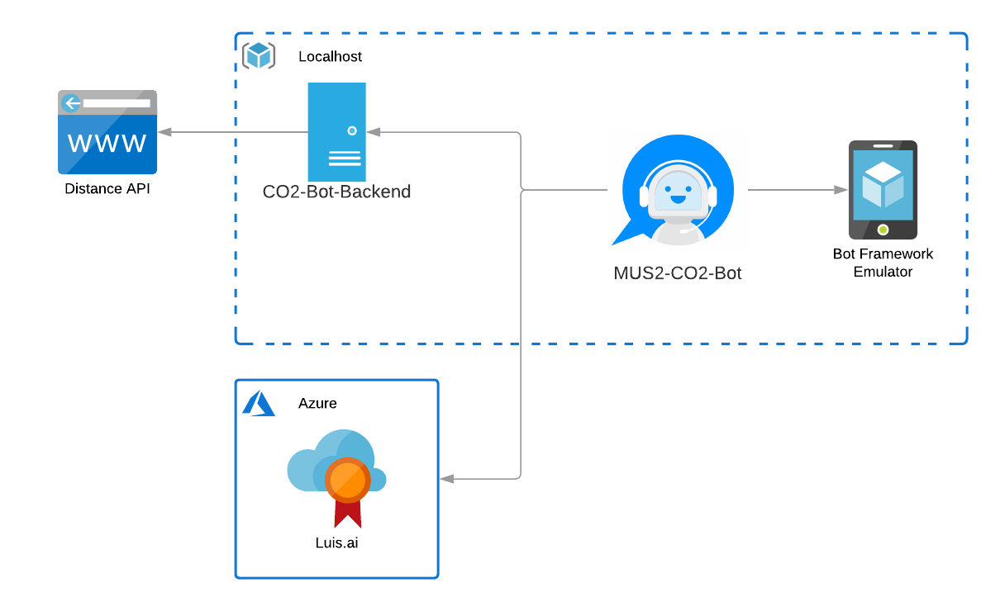

# mus-co2-bot

## Problem statement

Nowadays grocery shopping is really difficult if you want to do it with sustainability in mind. An abundance of products from all over the world are available for purchase in most supermarkets an shops and most people don't have an idea how much CO2 is produced in order to ship these products to their destinations.

In order to raise awareness for the global CO2 output and the preference of local products over foreign ones we want to create a chatbot which lets you easily know how much CO2 was generated only by shipping a product from its place of origin to its destination. Furthermore, to help user get a better understanding, useful analogies for the calculated amount of CO2 are provided.  

The bot will also include a feature which lets you create your own shopping list and calculates the emitted CO2 for all the products on your list.

## Implementation

### Architecture

### Backend

As the focus of this project lies on language understanding and the microsoft bot framework we decided so use a simple approach for our backend. A simple node.js server exposes an endpoint using express.js which is used by the bot in order to get CO2 information about a certain country/weight combination. In addition to the amount of CO2 it also returns an informative analogy according to the amount of CO2.

Because it proves difficult to find free apis which offer a specific functionality and additionally also require a registration most of the time, we decided to use a [free web service](https://www.luftlinie.org/) and parse its html content for the information we need.

Sources for the generated analogies can be found in the [server.js sourcecode](./backend/server.js)

### Bot Framework

beispiele für
* Dialogtrees 
* scopes
* variable binding
* http requests
* usw

### LUIS

Luis uses a certain model for its language understanding. More details can be found [here](https://docs.microsoft.com/en-us/azure/cognitive-services/luis/).  

We used a number of apps which then use a number of intents for the individual prompts we offer the user. In order to keep the model simple we decided to only use three entities. The first is the prebuild entity number which represents the weight of the user query. The remaining two entities are the machine learned entities country and product. The idea behind machine learned entities is that the luis model improves in identifying these with an increasing number of examples. Therefore we used a Phraselist for both classes to provide a solid starting set of examples.

When our bot is ready for starting new dialogs it sends the user input to our luis model which then returns the most likely intent to use and the predicted entities.  

## Results

As described above the bot can be used to query emitted CO2 for products and also emitted CO2 for whole shopping lists. It supports multiple natural language commands for its functionalities. For a better user experience it also supports commands to cancel the current query or to show the user available commands.

### Demo

// gif here

## References

* https://docs.microsoft.com/en-us/azure/bot-service/bot-builder-tutorial-basic-deploy?view=azure-bot-service-4.0&tabs=csharp  
* https://docs.microsoft.com/en-us/azure/bot-service/bot-service-channel-connect-telegram?view=azure-bot-service-4.0
